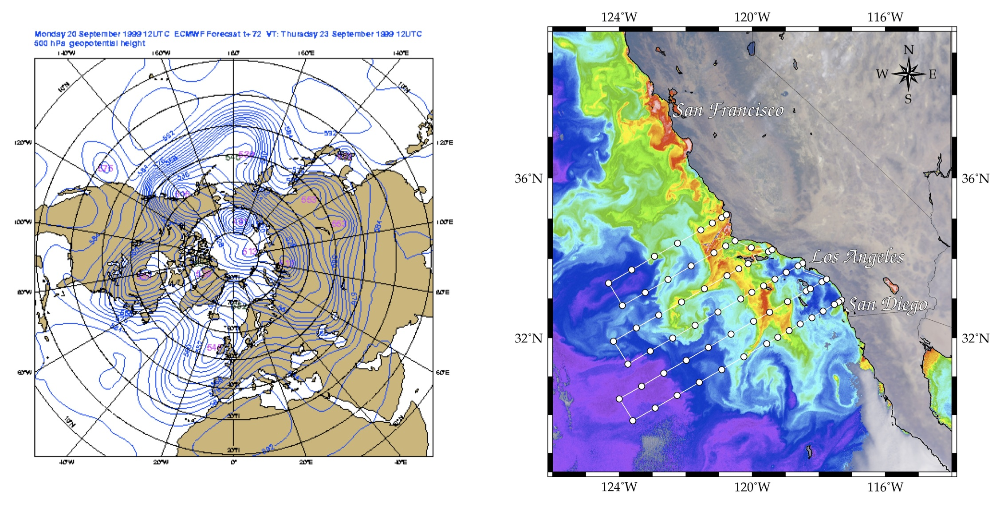

# Project 3: Rossby waves

## Background
Rossby waves are important persistent features of flows in the ocean and atmosphere. In this project, you will explore Rossby waves and eddies and their ability to mix and transport tracers.

ECMWF geopotential height map showing atmospheric Rossby waves (left) and ocean eddies visible in the phytoplankton concentration off the California coast (right)

Consider flow in a 2D plane, normal to the axis of rotation. In the next section, you will use Oceananigans to simulate flow in this plane. Consider small perturbations to a constant flow in the $x$-direction, $U$. Linearizing about the constant background flow, we have the following equations:
$$u'_t+Uu'_x - f(y) v' = -\frac{1}{\rho_0} p_x,$$
$$v'_t+Uv'_x + f(y) u' = -\frac{1}{\rho_0} p_y,$$
$$u'_x+v'_y=0.$$

Here, we will consider flow on the so-called '$\beta$-plane', where the Coriolis parameter is approximated as $f\simeq f_0+\beta y$. Since the flow is two-dimensional, it can be described by a streamfunction, $\psi'$, where $u'=-\psi'_y$, $v'=\psi'_x$. Taking the curl of the momentum equations to eliminate pressure gives
$$\nabla^2 \psi'_t+U\nabla^2 \psi'_x + \beta \psi'_x=0.$$

By looking for plane-wave solutions of the form:
$$\psi'=\psi_0 e^{i(kx+ly-\omega t)},$$
we can derive the Rossby wave dispersion relation:
$$\omega-kU=-\frac{k\beta}{k^2+l^2}.$$

## Simulations of Linear Rossby Waves
To simulate Rossby waves using Oceananigan, start with a '$\beta$-plane channel' geometry. Here, $x$ will correspond to the eastward direction, and $y$ will point north. Construct a $\beta$-plane channel by applying free-slip walls at the north and south boundaries of your domain, periodic boundary conditions in $x$, and a rotation vector coming out of the 2D plane in the $z$-direction. If you solve the non-dimensional equations (say with a domain size equal to 1 in both directions), the Rossby number controls the relative size of the nonlinear and Coriolis terms in the momentum equations. Since we want the nonlinear term to be small, pick a small Rossby number (say $1/Ro=I_{Ro}=100$). Set up the boundary conditions with free-slip walls in $y$, and force the pressure gradient to vanish at both walls ($\partial p/\partial y=0$). Set the beta effect using the BetaPlane function in Oceananigans. Here, we set the latitude to be 21N to match the bottom panel in Figure 2 in Chelton and Schlax (a pdf of this paper is in the project folder). 

To initialize the flow, create a streamfunction to mimic a plane-wave solution. To minimize edge effects, we can use a Gaussian envelope:
$$\psi'=\frac{1}{k^2+l^2}sin(kx)sin(ly) exp\left(\frac{-(y-LY/2)^2}{(LY/4)^2}\right).$$

We initialize the velocity field based on the definition of $\psi'$: $u'=-\psi'_y$, $v'=\psi'_x$. Choose the wavenumbers $k$ and $l$ to be large enough so that we can fit several wavelengths into the envelope. $k=4\pi/LX$, $l=4\pi/LY$, $Re=5000$, and $\beta=0.5$ seems to work reasonably well as a starting point (although you will se strong dispersion of the waves).

When you run the simulation, you should see the wave crests slowly propagate. Which direction do they move? After the simulation has progressed so the waves have moved by about one wavelength, stop the simulation. Estimate the phase speed of waves by creating a Hovm\"{o}ller diagram by plotting U1 at $y=LY/2$ as a function of $x$ and $t$. How does the phase speed compare to what you estimate from the dispersion relation, given above? Try varying $\beta$ and/or $k$ and $l$ and repeat the simulation and analysis. Qualitatively compare your results with observations in Chelton and Schlax.

## Suggested Further Investigations

### Transport by linear and nonlinear Rossby waves
An important difference between linear Rossby waves and nonlinear eddies in the ocean and atmosphere is their ability to transport fluid properties. First, examine transport by linear Rossby waves by introducing a passive scalar in the calculation above. Try initializing the scalar with the same structure as the streamfunction, and then visualize both the scalar and the streamfunction (or the pressure). Do the water crests move relative to the scalar field, or do the waves carry the scalar with them as they propagate? Do the waves stir the fluid?

Repeat this calculation for a much larger value of the Rossby number (say $1/Ro=1$). Now the nonlinear term will be quite large - how does the tracer transport change? You may have a difficult time diagnosing the wave nature of this flow since the nonlinear terms are so large. Try an intermediate value of the Rossby number. Can you see a combination of wave and eddy-like characteristics?

### 'Topographic' Rossby waves
Rossby waves can be generated in many ways - an important example is flow over topography. While our 2D code can't simulate flow over topography directly, we can add an artificial forcing to approximate the influence of a topographic feature. Set up a simulation with a small uniform velocity in the $x$-direction. Then add a region of localized forcing, opposing the initial flow. Here, we can think of the force as an extra drag on the flow, which could be generated, for example, by flow over topography. To make sure that we can reach a steady-state, adjust the body force so that its mean vanishes. Run Oceananigans - eventually a standing wave pattern should develop. What does this say about the phase speed measured in a coordinate from moving with the mean flow?

Now, try making the forcing function time-dependent. By varying the frequency of the forcing, can you get waves to propagate both up and downstream? What scale do the waves have? Can you predict this from the dispersion relation?

### Coastal upwelling zone (ambitious)
Try to devise a numerical experiment to investigate tracer transport by Rossby waves away from an eastern boundary (as in the second figure). Add walls to the eastern and western edges of your domain. Add a forcing function to mimic the generation of eddies and Rossby waves through baroclinic instability (localize this along the eastern boundary, and try to set it so that you can control the Rossby number of the resulting motions). Add a passive tracer which is zero everywhere except along the eastern wall.  Add a decay term to the passive tracer equation. Does the tracer reach an equilibrium state?  How far does it extend away from the eastern boundary?  How does this depend on the Rossby number of your flow and the tracer decay timescale?

### Rossby graveyard (ambitious)
Zhai (a pdf is in the project folder) proposed that a significant amount of energy is dissipated when nonlinear Rossby waves and westward propagating eddies 'break' at western boundaries. By adding free-slip or no-slip boundaries the x-direction, examine what happens when Rossby waves encounter a north/south boundary.
